# Hands-on 01: Uso de modelos de propagação para análises sistêmicas
## Parte 01: Avaliação de cobertura celular
### Metas
* Criar um Grid Hexagonal para modelar cobertura de Estações Rádio Base;
* Analisar potência recebida visualmente por meio de Radio Environment Maps (REMs);
* Fazer exemplo de estudo de Outage de potência.

### Prática 01: Criação de grid celular hexagona
#### Passo 01
* A função ```fDrawSector.m``` foi criada. Ela é responsável pela criação de um hexágono.
```
%%file fDrawSector.m

function fDrawSector(dR,dCenter)%dr = raio de cada hexágono; dCenter = 
vtHex=zeros(1,0);
for ie=1:6
    vtHex=[vtHex dR*(cos((ie-1)*pi/3)+j*sin((ie-1)*pi/3))];
end
vtHex=vtHex+dCenter;
vtHexp=[vtHex vtHex(1)];
plot(vtHexp,'k');

%fDrawSector(100,100+50*i)
%DESENHA UM HEXAGONO
```
##### Criado o arquivo: ```fDrawSector.m```.

#### Passo 02
* Para testar a função ```fDrawSector``` criada no passo anterior, é necessário setar um valor default na chamada da função, que foi: 100,100+50*i.  
Este valor pode ser inserido direto no run ou ainda ser inserido dentro da chamada da função no console, dessa forma: ```fDrawSector(100,100+50*i)```.  
.png)  
O hexágono foi validado.
##### Criado o arquivo: hexágono_centrado_no_ponto_(100,50).png.

#### Passo 03
* A função ```fDrawDeploy.m``` foi criada. Ela é responsável por desenhar o grid celular. 
```
%%file fDrawDeploy.m
function fDrawDeploy(dR,vtBs)
% Desenha setores hexagonais
hold on;
for iBsD = 1 : length(vtBs)
    fDrawSector(dR,vtBs(iBsD));
end
% Plot BSs
plot(vtBs,'sk'); axis equal;
end

%DESENHA UM GRID CELULAR
%grid é uma estrutura geométrica constituída por eixos (comumente horizontais e verticais)
```
##### Criado o arquivo: ```fDrawDeploy.m```.

#### Passo 04
* O código em ```handson1_P1_1.m``` foi degubado e comentado para melhor entendimento.
```
dR = 5e3; % Raio do Hexágono
dIntersiteDistance = 2*sqrt(3/4)*dR; % Distância entre ERBs (somente para informação)
dDimX = 5*dR;  % Dimensão X do grid
dDimY = 6*sqrt(3/4)*dR; % Dimensão Y do grid
% Vetor com posições das BSs (grid Hexagonal com 7 células, uma célula central e uma camada de células ao redor)
vtBs = [ 0 ];
dOffset = pi/6;
for iBs = 2 : 7
    vtBs = [ vtBs dR*sqrt(3)*exp( j * ( (iBs-2)*pi/3 + dOffset ) ) ];
end
vtBs = vtBs + (dDimX/2 + j*dDimY/2); % Ajuste de posição das bases (posição relativa ao canto inferior esquerdo)

% Desenha setores hexagonais
fDrawDeploy(dR,vtBs) %grid já criado, com 7 ERBs
axis equal;

%DESENHA 7 HEXAGONOS --> fDrawSector(dR,dCenter); fDrawSector(100,100+50*i)
%DENTRO DE UM GRID --> fDrawDeploy(dR,vtBs); fDrawDeploy(5000,[1.250000000000000e+04 + 1.299038105676658e+04i 2.000000000000000e+04 + 1.732050807568877e+04i 1.250000000000000e+04 + 2.165063509461097e+04i 5.000000000000002e+03 + 1.732050807568878e+04i 4.999999999999998e+03 + 8.660254037844390e+03i 1.250000000000000e+04 + 4.330127018922194e+03i 2.000000000000000e+04 + 8.660254037844390e+03i])
```
.png)  
O vetor com a posição das 7 ERBs foi criada corretamente, dentro do grid que já havia sido criado. 
##### Foram criados os arquivos: ```handson1_P1_1.m``` e vetor_com_posição_das_7_ERBs_centrado_em_(0,0).png.

### Prática 02: Criação dos pontos de medição
Esta prática criou os pontos de medição do REM de cada ERB. Foram criadas 7 matrizes, sendo uma matriz de pontos de medição para cada ERB. Elas foram armazenadas numa matriz 3D denomida mtPosEachBS. Cada elemento da matriz (pocisionamento de cada ponto de medição) é modelado como um número complexo X + jY, sendo X a posição na abscissa e, Y a posição no eixo das ordenadas.
#### Passo 01
* O código ```handson1_P21.m``` foi criado e debugado. Também foi criado o plot das posições relativas dos pontos de medição de cada ERB.
```
clear all;clc;close all;  % Limpa variáveis, limpa tela e fecha todas as figuras
%#Tudo é limpo aqui.

% Entrada de parâmetros
dR = 5e3; % 	  
%#Após essa linha dr recebe o valor de 5000.

% Cálculos de outras variáveis que dependem dos parâmetros de entrada
dPasso = ceil(dR/10);   % Resolução do grid: distância entre pontos de medição
%#Após essa linha dPasso recebe o valor de 500.

dIntersiteDistance = 2*sqrt(3/4)*dR; % Distância entre ERBs (somente para informação)
%#dIntersiteDistance recebe 8.6603e+03.

dDimX = 5*dR;   % Dimensão X do grid
%dDimX recebe o valor de 2500.
dDimY = 6*sqrt(3/4)*dR;  % Dimensão Y do grid
%dDimY recebe o valor de 2.59801e+04.

% Vetor com posições das BSs (grid Hexagonal com 7 células, uma célula central e uma camada de células ao redor)
vtBs = [ 0 ];
%vtBs recebe 0.

dOffset = pi/6;
%dOffset recebe 0.5236.

%Pra que serve esse primeiro for??? Para implementar o vtBs
for iBs = 2 : 7
    %iBs é iterado aqui
    vtBs = [ vtBs dR*sqrt(3)*exp( j * ( (iBs-2)*pi/3 + dOffset ) ) ]; %vtBs é iterado aqui
end
vtBs = vtBs + (dDimX/2 + j*dDimY/2); % Ajuste de posição das bases 
%                                    (posição relativa ao canto inferior esquerdo)
%

%
% Matriz de referência com posição de cada ponto do grid (posição relativa ao canto inferior esquerdo)
dDimY = dDimY+mod(dDimY,dPasso); % Ajuste de dimensão para medir toda a dimensão do grid
dDimX = dDimX+mod(dDimX,dPasso); % Ajuste de dimensão para medir toda a dimensão do grid
[mtPosx,mtPosy] = meshgrid(0:dPasso:dDimX, 0:dPasso:dDimY);
%


% Calcular os pontos de medição relativos de cada ERB
for iBsD = 1 : length(vtBs)                                 % Loop nas 7 ERBs
    % Matriz 3D com os pontos de medição de cada ERB. Os pontos são
    % modelados como números complexos X +jY, sendo X a posição na abcissa e Y, a posição no eixo das ordenadas
    mtPosEachBS(:,:,iBsD)=(mtPosx + j*mtPosy)-(vtBs(iBsD));
    % Plot da posição relativa dos pontos de medição de cada ERB individualmente
    figure; %depois da execução desta linha --> imagem em branco 
    plot(mtPosEachBS(:,:,iBsD),'bo'); %depois da execução desta linha --> criado as grades
    hold on;
    fDrawDeploy(dR,vtBs-vtBs(iBsD)) %depois da execução desta linha --> as células são desenhadas %o eixo y foi modificado
    axis equal; %depois da execução desta linha --> img é centralizada
    title(['ERB ' num2str(iBsD)]);%depois da execução desta linha --> titulo
end

%DESENHA AS 7 ERBS, COM 7 CÉLULAS EM CADA, COM DIFERENTES CENTRALIZAÇÕES
```
As 7 ERBs plotadas, estão mostradas abaixo:  
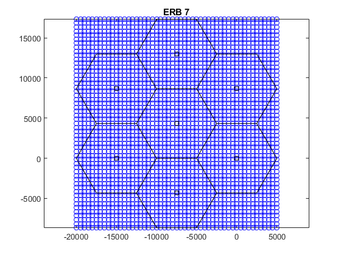 
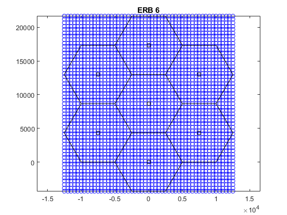 
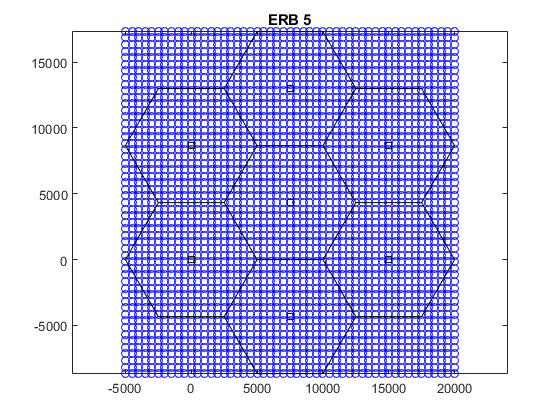 
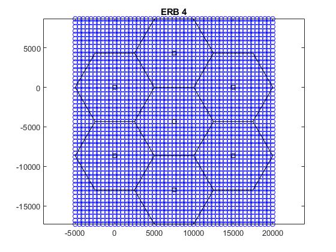 
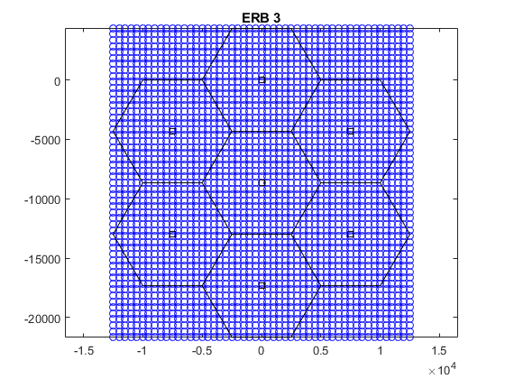 
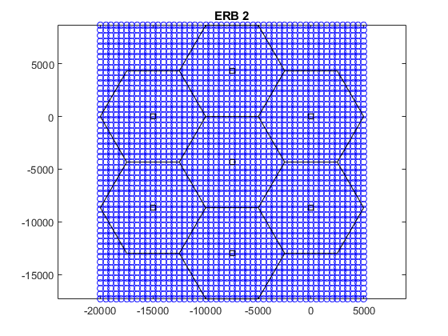 
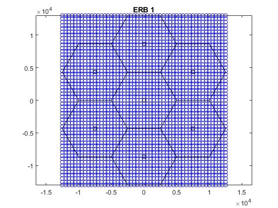 
##### Foram criados os arquivos: ```handson1_P21.m```, ERB_7.png, ERB_6.png, ERB_5.png, ERB_4.png, ERB_3.png, ERB_2.png, ERB_1.png.

### Prática 03: Cálculo e plot da potência recebida
#### Passo 01
* O código de ```handson1_p31.m``` foi degubado e salvo.  
* Por meio deste código foram criados sete matrizes de distâncias relativas de cada ponto de medição e para cada ERB.
* Para calcular a perda de percurso (matrizes mtPldB), foi usado o modelo de Okumura-Hata para grandes cidades.
* A potência recebida de cada ERB em cada ponto de medição, foi calculada com a EIRP e a perda de percurso. Para cada ERB foi montada a matriz mtPowerEachBSdBm
* Foi criada uma única matriz mtPowerFinaldBm com a maior potência recebida em cada ponto de medição e foi plotado o REM de cada ERB e da composição das 7 ERBs.

```
% Entrada de parâmetros
dR = 5e3;  % Raio do Hexágono
dFc = 800; % Frequência da portadora MHz

% Cálculos de outras variáveis que dependem dos parâmetros de entrada
dPasso = ceil(dR/10);  % Resolução do grid: distância entre pontos de medição
dRMin = dPasso; % Raio de segurança
dIntersiteDistance = 2*sqrt(3/4)*dR;  % Distância entre ERBs (somente para informação)
dDimX = 5*dR;  % Dimensão X do grid
dDimY = 6*sqrt(3/4)*dR;  % Dimensão Y do grid
dPtdBm = 57; % EIRP (incluindo ganho e perdas) (https://pt.slideshare.net/naveenjakhar12/gsm-link-budget)
dPtLinear = 10^(dPtdBm/10)*1e-3;  % EIRP em escala linear
dHMob = 5;  % Altura do receptor
dHBs = 30;  % Altura do transmissor
dAhm = 3.2*(log10(11.75*dHMob)).^2 - 4.97;  % Modelo Okumura-Hata: Cidade grande e fc  >= 400MHz


% Vetor com posições das BSs (grid Hexagonal com 7 células, uma célula central e uma camada de células ao redor)
vtBs = [ 0 ];
dOffset = pi/6;

for iBs = 2 : 7
    vtBs = [ vtBs dR*sqrt(3)*exp( j * ( (iBs-2)*pi/3 + dOffset ) ) ];
end
vtBs = vtBs + (dDimX/2 + j*dDimY/2);    % Ajuste de posição das bases (posição relativa ao canto inferior esquerdo)
%
% Matriz de referência com posição de cada ponto do grid (posição relativa ao canto inferior esquerdo)
dDimY = dDimY+mod(dDimY,dPasso);                           % Ajuste de dimensão para medir toda a dimensão do grid
dDimX = dDimX+mod(dDimX,dPasso);                           % Ajuste de dimensão para medir toda a dimensão do grid
[mtPosx,mtPosy] = meshgrid(0:dPasso:dDimX, 0:dPasso:dDimY);
%
% Iniciação da Matriz de  pontência recebida máxima em cada ponto
% medido. Essa potência é a maior entre as 7 ERBs.
mtPowerFinaldBm = -inf*ones(size(mtPosy));
% Calcular O REM de cada ERB e aculumar a maior potência em cada ponto de medição
for iBsD = 1 : length(vtBs)                                 % Loop nas 7 ERBs
    % Matriz 3D com os pontos de medição de cada ERB. Os pontos são
    % modelados como números complexos X +jY, sendo X a posição na abcissa e Y, a posição no eixo das ordenadas
    mtPosEachBS(:,:,iBsD)=(mtPosx + j*mtPosy)-(vtBs(iBsD));
    mtDistEachBs = abs(mtPosEachBS(:,:,iBsD));              % Distância entre cada ponto de medição e a sua ERB
    mtDistEachBs(mtDistEachBs < dRMin) = dRMin;             % Implementação do raio de segurança
    % Okumura-Hata (cidade urbana) - dB
    mtPldB = 69.55 + 26.16*log10(dFc) + (44.9 - 6.55*log10(dHBs))*log10(mtDistEachBs/1e3) - 13.82*log10(dHBs) - dAhm;
    mtPowerEachBSdBm(:,:,iBsD) = dPtdBm - mtPldB;           % Potências recebidas em cada ponto de medição
    % Plot da REM de cada ERB individualmente
    figure;
    pcolor(mtPosx,mtPosy,mtPowerEachBSdBm(:,:,iBsD));
    colorbar;
    % Desenha setores hexagonais
    fDrawDeploy(dR,vtBs)
    axis equal;
    title(['ERB ' num2str(iBsD)]);
    % Cálulo da maior potência em cada ponto de medição
    mtPowerFinaldBm = max(mtPowerFinaldBm,mtPowerEachBSdBm(:,:,iBsD));
end
% Plot da REM de todo o grid (composição das 7 ERBs)
figure;
pcolor(mtPosx,mtPosy,mtPowerFinaldBm);
colorbar;
fDrawDeploy(dR,vtBs);
axis equal;
title(['Todas as 7 ERB']);
```
Os REMs de cada ERB e da composição das 7 ERBs, estão mostradas abaixo:  
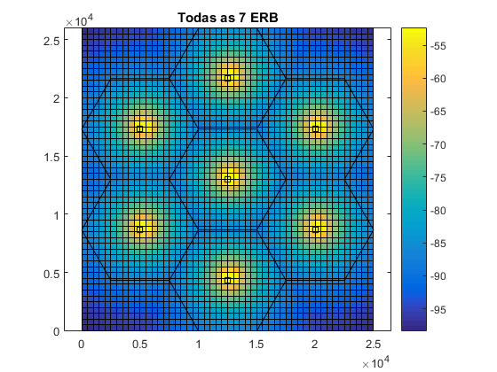 
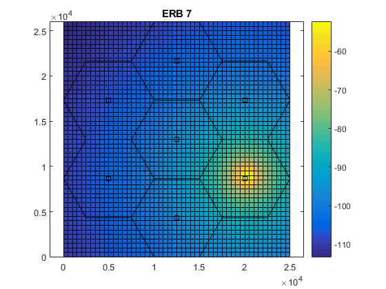 
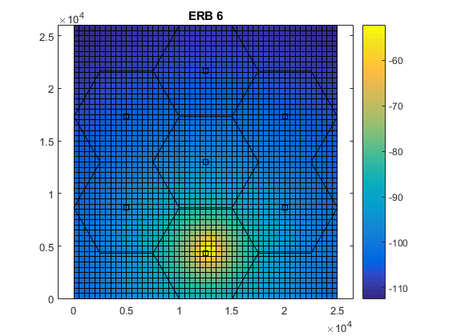 
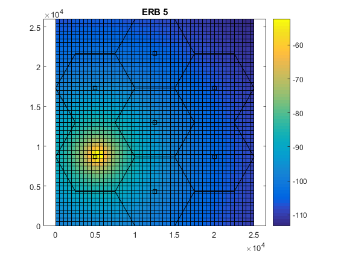 
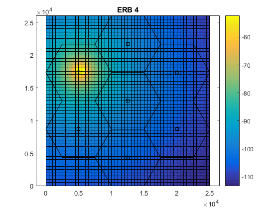 
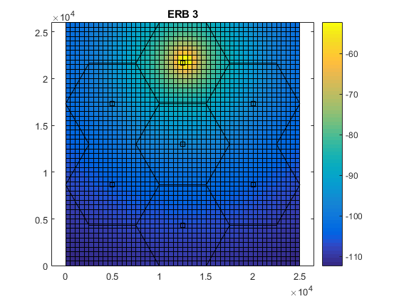 
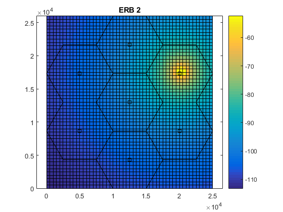 
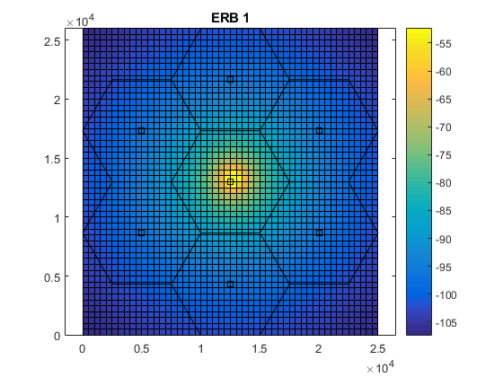 

##### Foram criados os arquivos: ```handson1_p31.m```, 7_ERBs_REM.png, ERB_7_REM.png, ERB_6_REM.png, ERB_5_REM.png, ERB_4_REM.png, ERB_3_REM.png, ERB_2_REM.png, ERB_1_REM.png.

### Prática 04: Cálculo da Outage
* Nesta prática foi calculado a taxa de outage de potência, i.e., a porcentagem de pontos que estão com potência abaixo da sensibilidade do receptor.
#### Passo 01
* O código ```handson1_p41.m``` foi debugado e salvo. nele, foi definido a sensibilidade do receptor (dSensitivity = -104) e a resolução do grid foi aumentada, por meio do número de pontos de medição (dPasso = dR/50).
```
%vetor de frequências da portadora MHz.
vtFc = [800 900 1800 1900 2100];
for iFc = 1:length(vtFc) %for para percorrer o vetor das frequência, vai ser feito 5x
    %dFc recebe a posição atual do vtFc.
    dFc = vtFc(iFc);
    % Entrada de parâmetros
    dR = 10e3; % Raio do Hexágono
    % Cálculos de outras variáveis que dependem dos parâmetros de entrada
    dPasso = ceil(dR/50); % Resolução do grid: distância entre pontos de medição
    dRMin = dPasso;  % Raio de segurança
    dIntersiteDistance = 2*sqrt(3/4)*dR;  % Distância entre ERBs (somente para informação)
    dDimX = 5*dR; % Dimensão X do grid
    dDimY = 6*sqrt(3/4)*dR;  % Dimensão Y do grid
    dPtdBm = 57;  % EIRP (incluindo ganho e perdas) (https://pt.slideshare.net/naveenjakhar12/gsm-link-budget)
    dPtLinear = 10^(dPtdBm/10)*1e-3;  % EIRP em escala linear
    dSensitivity = -104; % Sensibilidade do receptor (http://www.comlab.hut.fi/opetus/260/1v153.pdf)
    dHMob = 5;  % Altura do receptor
    dHBs = 30;  % Altura do transmissor
    dAhm = 3.2*(log10(11.75*dHMob)).^2 - 4.97; % Modelo Okumura-Hata: Cidade grande e fc  >= 400MHz
    
    % Vetor com posições das BSs (grid Hexagonal com 7 células, uma célula central e uma camada de células ao redor)
    vtBs = [ 0 ];
    dOffset = pi/6;
    for iBs = 2 : 7
        vtBs = [ vtBs dR*sqrt(3)*exp( j * ( (iBs-2)*pi/3 + dOffset ) ) ];
    end
    vtBs = vtBs + (dDimX/2 + j*dDimY/2);  % Ajuste de posição das bases (posição relativa ao canto inferior esquerdo)
    
    % Matriz de referência com posição de cada ponto do grid (posição relativa ao canto inferior esquerdo)
    dDimY = ceil(dDimY+mod(dDimY,dPasso)); % Ajuste de dimensão para medir toda a dimensão do grid
    dDimX = ceil(dDimX+mod(dDimX,dPasso)); % Ajuste de dimensão para medir toda a dimensão do grid
    [mtPosx,mtPosy] = meshgrid(0:dPasso:dDimX, 0:dPasso:dDimY);
    
    % Iniciação da Matriz de com a pontência de recebida máxima em cada ponto medido. Essa potência é a maior entre as 7 ERBs.
    % Ones(size(mtPosy) cria uma matriz de 1 do tamanho de mtPosy: 261x251.
    % -Inf(n) returns an n-by-n matrix of -Inf values: -inf*ones(size(mtPosy)) retorna uma matriz de 261x251 com -inf valores.
    mtPowerFinaldBm = -inf*ones(size(mtPosy));
    
    % Calcular O REM de cada ERB e aculumar a maior potência em cada ponto de medição
    for iBsD = 1 : length(vtBs)   % Loop nas 7 ERBs
        % Matriz 3D com os pontos de medição de cada ERB. Os pontos são modelados como números complexos X +jY, sendo X a posição na abcissa e Y, a posição no eixo das ordenadas
        mtPosEachBS =(mtPosx + j*mtPosy)-(vtBs(iBsD));
        
        % Y = abs(X) returns the absolute value of each element in array X. If X is complex, abs(X) returns the complex magnitude.
        mtDistEachBs = abs(mtPosEachBS); % Distância entre cada ponto de medição e a sua ERB
        mtDistEachBs(mtDistEachBs < dRMin) = dRMin;   % Implementação do raio de segurança
        % Okumura-Hata (cidade urbana) - dB
        mtPldB = 69.55 + 26.16*log10(dFc) + (44.9 - 6.55*log10(dHBs))*log10(mtDistEachBs/1e3) - 13.82*log10(dHBs) - dAhm;
        mtPowerEachBSdBm = dPtdBm - mtPldB;           % Potências recebidas em cada ponto de medição
        % Cálulo da maior potência em cada ponto de medição
        mtPowerFinaldBm = max(mtPowerFinaldBm,mtPowerEachBSdBm);
    end
    
    % Outage (limite 10%)
    dOutRate = 100*length(find(mtPowerFinaldBm < dSensitivity))/numel(mtPowerFinaldBm);
    disp(['Frequência da portadora = ' num2str(dFc)]);
    disp(['Taxa de outage = ' num2str(dOutRate) ' %']);
end
```
A saída da execução do ```handson1_p41.m``` é:
```
Frequência da portadora = 800
Taxa de outage = 7.5193 %
Frequência da portadora = 900
Taxa de outage = 10.8043 %
Frequência da portadora = 1800
Taxa de outage = 46.7555 %
Frequência da portadora = 1900
Taxa de outage = 50.8006 %
Frequência da portadora = 2100
Taxa de outage = 57.6315 %
```
##### Foi criado o arquivo: ```handson1_p41.m```.

