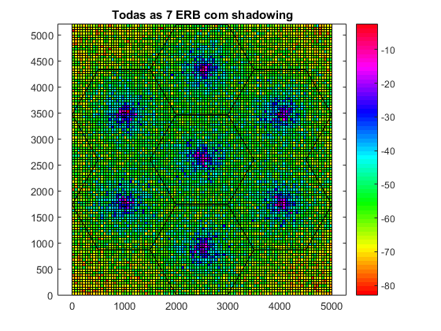

# Hands-on 01: Uso de modelos de propagação para análises sistêmicas
## Parte 02: Modelagem do Sombreamento
### Metas
* Análise visual de potência recebida com sobreamento;
* Implementação do sombreamento correlacionado.

### Prática 01: Sobreamento descorrelacionado
Esta prática tem o objetivo de escrever um código para criação do mapa de cobertura (REM) das 7 (sete) estações rádio base (ERBs).
#### Passo 01
* A função ```fDrawSector.m``` foi criada. Ela é responsável pela criação de um hexágono.
```
%%file fDrawSector.m
function fDrawSector(dR,dCenter)
%Desenha um hexagono.
vtHex=zeros(1,0);
for ie=1:6
    vtHex=[vtHex dR*(cos((ie-1)*pi/3)+j*sin((ie-1)*pi/3))];
end
vtHex=vtHex+dCenter;
vtHexp=[vtHex vtHex(1)];
plot(vtHexp,'k');

%fDrawSector(100,100+50*i)
```
##### Criado o arquivo: ```fDrawSector.m```.

#### Passo 02
* Para testar a função ```fDrawSector``` criada no passo anterior, é necessário setar um valor default na chamada da função, que foi: 100,100+50*i.  
Este valor pode ser inserido direto no run ou ainda ser inserido dentro da chamada da função no console, dessa forma: ```fDrawSector(100,100+50*i)```.  
.png)   
O hexágono foi validado.
##### Criado o arquivo: hexágono_centrado_no_ponto_(100,50).png.

#### Passo 03
* A função ```fDrawDeploy.m``` foi criada. Ela é responsável por desenhar o grid celular. 
```
%%file fDrawDeploy.m
function fDrawDeploy(dR,vtBs)
% Desenha setores hexagonais
hold on;
for iBsD = 1 : length(vtBs)
    fDrawSector(dR,vtBs(iBsD));
end
% Plot BSs
plot(vtBs,'sk'); axis equal;
end
```
##### Criado o arquivo: ```fDrawDeploy.m```.

#### Passo 04
* O código ``` handson2_P2_1.m``` foi debugado e salvo. Ele foi responsável pela criação do vetor com a posição das 7 ERBs, o vtBs.
```
dR = 5e3; %Raio do Hexágono.
dIntersiteDistance = 2*sqrt(3/4)*dR; %Distância entre ERBs (somente para informação).
dDimX = 5*dR; %Dimensão X do grid.
dDimY = 6*sqrt(3/4)*dR; %Dimensão Y do grid.

%Vetor com posições das BSs (grid Hexagonal com 7 células, uma célula central e uma camada de células ao redor).
vtBs = [0];
dOffset = pi/6;
for iBs = 2 : 7
    vtBs = [vtBs dR*sqrt(3)*exp(j * ((iBs-2)*pi/3 + dOffset))];
end
vtBs = vtBs + (dDimX/2 + j*dDimY/2); %Ajuste de posição das bases (posição relativa ao canto inferior esquerdo).

% Desenha setores hexagonais
fDrawDeploy(dR,vtBs)
axis equal;

%Precisa do vtBs para ser passado como argumento do fDrawDeploy.
```
   
##### Foram criados os arquivos: ```handson2_P2_1.m``` e setores_hexagonais.png.

### Prática 02: Cálculo e plot da potência recebida sem e com shadowing
Foi escrito um código para o cálculo da potência recebida nos pontos de medição do REM de cada ERB, considerando a composição das 7 ERBs. Também foi considerado que a potência recebida de cada ponto de medição é a maior potência recebida em relação às 7 ERBs.

#### Passo 01
* O código ```handson2_p21.m ``` foi debugado e salvo.  
* Neste código foi criado sete matrizes mtDistEachBs, que são matrizes de distâncias relativas de cada ponto de medição e para cada ERB.
* A partir destas distâncias foi usado o modelo de Okumura-Hata para calcular a perda de percurso, esse cálculo foi feito nas matrizes mtPldB.
* Nas matrizes mtShadowing, foram armazenados os valores que foram sorteados baseado em uma distribiução Lognormal amostras independentes do Sombreamento para cada ponto de medição.
* Para cada ERB foi montada a matriz mtPowerEachBSdBm. Ela foi calculada a partir de matrizes de EIRP, da perda de percurso e do sombreamento e do cálculo de potência recebida de cada ERB em cada ponto de medição.
* Foi montadada uma única matriz mtPowerFinaldBm com a maior potência recebida em cada ponto de medição e o REM da composição das 7 ERBs foi plotado com e sem sombreamento.
```
% Entrada de parâmetros.-
dR = 1e3; %Raio do Hexágono.
dFc = 800; %Frequência da portadora.
dSigmaShad = 8; %Desvio padrão do sombreamento lognormal.

%Cálculos de outras variáveis que dependem dos parâmetros de entrada.
%ceil arredonda o seu argumento para um inteiro maior ou igual ao argumento.
dPasso = ceil(dR/20); %Resolução do grid: distância entre pontos de medição.
dRMin = dPasso; %Raio de segurança.
dIntersiteDistance = 2*sqrt(3/4)*dR; %Distância entre ERBs (somente para informação).
dDimX = 5*dR; %Dimensão X do grid.
dDimY = 6*sqrt(3/4)*dR; %Dimensão Y do grid.
dPtdBm = 57; %EIRP (incluindo ganho e perdas).
dPtLinear = 10^(dPtdBm/10)*1e-3; %EIRP em escala linear.
dHMob = 5; %Altura do receptor.
dHBs = 30; %Altura do transmissor.
dAhm = 3.2*(log10(11.75*dHMob)).^2 - 4.97; % Modelo Okumura-Hata: Cidade grande e fc >= 400MHz.

%Vetor com posições das BSs (grid Hexagonal com 7 células, uma célula central e uma camada de células ao redor).
vtBs = [0];
dOffset = pi/6;
for iBs = 2 : 7
    vtBs = [vtBs dR*sqrt(3)*exp(j * ((iBs-2)*pi/3 + dOffset))];
end
vtBs = vtBs + (dDimX/2 + j*dDimY/2); %Ajuste de posição das bases (posição relativa ao canto inferior esquerdo).

%Matriz de referência com posição de cada ponto do grid (posição relativa ao canto inferior esquerdo)
dDimY = ceil(dDimY+mod(dDimY,dPasso));  %Ajuste de dimensão para medir toda a dimensão do grid.
dDimX = ceil(dDimX+mod(dDimX,dPasso));  %Ajuste de dimensão para medir toda a dimensão do grid.
%[mtPosx,mtPosy] = meshgrid(0:dPasso:dDimX, 0:dPasso:dDimY) returns 2-D grid coordinates based on the coordinates contained in vectors 0:dPasso:dDimX and 0:dPasso:dDimY.
[mtPosx,mtPosy] = meshgrid(0:dPasso:dDimX, 0:dPasso:dDimY);
%Iniciação da Matriz com a máxima potência recebida em cada ponto medido. Essa potência é a maior entre as 7 ERBs.
mtPowerFinaldBm = -inf*ones(size(mtPosy));
mtPowerFinalShaddBm = -inf*ones(size(mtPosy));

%Criação de sete matrizes de distâncias relativas de cada ponto de medição e para cada ERB (matrizes mtDistEachBs).
%Calcular O REM de cada ERB e acumular a maior potência em cada ponto de medição.
for iBsD = 1 : length(vtBs) %Loop nas 7 ERBs.
    %Matriz 3D com os pontos de medição de cada ERB. Os pontos são modelados como números complexos X +jY, sendo X a posição na abcissa e Y, a posição no eixo das ordenadas.
    
    %Matrizes de perda de EIRP.
    mtPosEachBS = (mtPosx + j*mtPosy)-(vtBs(iBsD));
    mtDistEachBs = abs(mtPosEachBS); %Distância entre cada ponto de medição e a sua ERB.
    mtDistEachBs(mtDistEachBs < dRMin) = dRMin;  %Implementação do raio de segurança.
    
    %Matrizes de perda de percurso.
    %Okumura-Hata (cidade urbana) - dB. Cálculo da perda de percurso.
    mtPldB = 69.55 + 26.16*log10(dFc) + (44.9 - 6.55*log10(dHBs))*log10(mtDistEachBs/1e3) - 13.82*log10(dHBs) - dAhm;
    
    %Matrizes de sombreamento.
    %Shadowing independente em cada ponto.
    %dSigmaShad = 8 %Desvio padrão do sombreamento lognormal.
    %randn(sz) returns an array of random numbers where size vector sz defines size(X). For example, randn([3 4]) returns a 3-by-4 matrix.
    %mtShadowing = 8*randn([105   101]);
    mtShadowing = dSigmaShad*randn(size(mtPosy));
    
    %Potências recebidas em cada ponto de medição sem shadowing.
    mtPowerEachBSdBm = dPtdBm - mtPldB;   %(EIRP)57 - Okumura Hata        
    %Potências recebidas em cada ponto de medição com shadowing.
    mtPowerEachBSShaddBm = dPtdBm - mtPldB + mtShadowing;  
    
    %Cálulo da maior potência em cada ponto de medição sem shadowing.
    %C = max(A,B) returns an array with the largest elements taken from A or B.
    %mtPowerFinaldBm com a maior potência recebida em cada ponto de medição.
    mtPowerFinaldBm = max(mtPowerFinaldBm,mtPowerEachBSdBm);
    
    %Cálulo da maior potência em cada ponto de medição com shadowing
    mtPowerFinalShaddBm = max(mtPowerFinalShaddBm,mtPowerEachBSShaddBm);
end

%Plot da REM de todo o grid (composição das 7 ERBs) sem shadowing.
figure;
pcolor(mtPosx,mtPosy,mtPowerFinaldBm);
colormap(hsv);
colorbar;
fDrawDeploy(dR,vtBs);
axis equal;
title(['Todas as 7 ERB sem shadowing']);

%Plot da REM de todo o grid (composição das 7 ERBs) sem shadowing.
figure;
pcolor(mtPosx,mtPosy,mtPowerFinalShaddBm);
colormap(hsv);
colorbar;
fDrawDeploy(dR,vtBs);
axis equal;
title(['Todas as 7 ERB com shadowing']);
```
   
   
##### Foram criados os arquivos: ```handson2_p21.m ```, todas_7_ERB_shadowing.png e todas_7_ERB_sem_shadowing.png.

### Sombreamento correlacionado