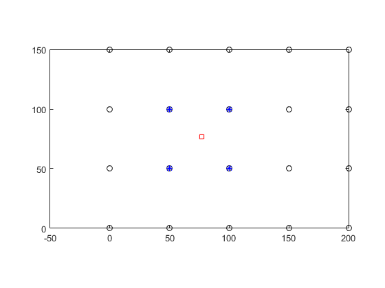
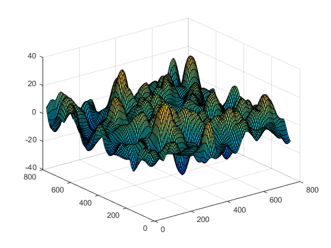
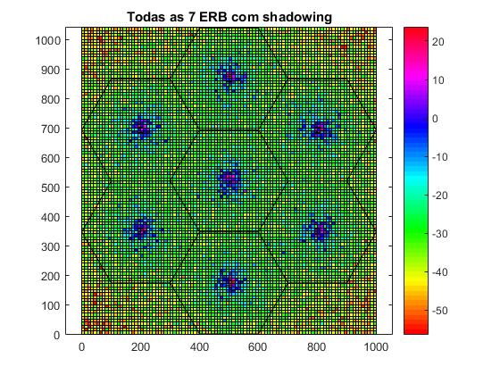
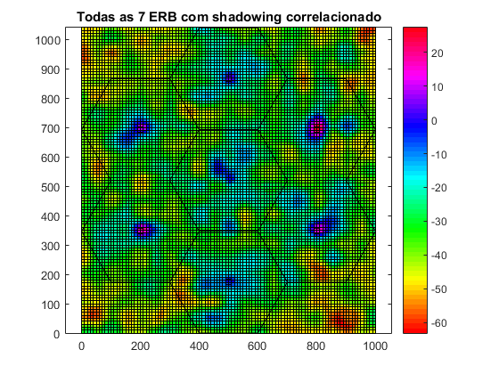

# Hands-on 01: Uso de modelos de propagação para análises sistêmicas
## Parte 02: Modelagem do Sombreamento
### Metas
* Análise visual de potência recebida com sobreamento;
* Implementação do sombreamento correlacionado.

### Prática 01: Sobreamento descorrelacionado
Esta prática tem o objetivo de escrever um código para criação do mapa de cobertura (REM) das 7 (sete) estações rádio base (ERBs).
#### Passo 01
* A função ```fDrawSector.m``` foi criada. Ela é responsável pela criação de um hexágono.
```
%%file fDrawSector.m
function fDrawSector(dR,dCenter)
%Desenha um hexagono.
vtHex=zeros(1,0);
for ie=1:6
    vtHex=[vtHex dR*(cos((ie-1)*pi/3)+j*sin((ie-1)*pi/3))];
end
vtHex=vtHex+dCenter;
vtHexp=[vtHex vtHex(1)];
plot(vtHexp,'k');

%fDrawSector(100,100+50*i)
```
##### Criado o arquivo: ```fDrawSector.m```.

#### Passo 02
* Para testar a função ```fDrawSector``` criada no passo anterior, é necessário setar um valor default na chamada da função, que foi: 100,100+50*i.  
Este valor pode ser inserido direto no run ou ainda ser inserido dentro da chamada da função no console, dessa forma: ```fDrawSector(100,100+50*i)```.  
.png)   
O hexágono foi validado.
##### Criado o arquivo: hexágono_centrado_no_ponto_(100,50).png.

#### Passo 03
* A função ```fDrawDeploy.m``` foi criada. Ela é responsável por desenhar o grid celular. 
```
%%file fDrawDeploy.m
function fDrawDeploy(dR,vtBs)
% Desenha setores hexagonais
hold on;
for iBsD = 1 : length(vtBs)
    fDrawSector(dR,vtBs(iBsD));
end
% Plot BSs
plot(vtBs,'sk'); axis equal;
end
```
##### Criado o arquivo: ```fDrawDeploy.m```.

#### Passo 04
* O código ``` handson2_P2_1.m``` foi debugado e salvo. Ele foi responsável pela criação do vetor com a posição das 7 ERBs, o vtBs.
```
dR = 5e3; %Raio do Hexágono.
dIntersiteDistance = 2*sqrt(3/4)*dR; %Distância entre ERBs (somente para informação).
dDimX = 5*dR; %Dimensão X do grid.
dDimY = 6*sqrt(3/4)*dR; %Dimensão Y do grid.

%Vetor com posições das BSs (grid Hexagonal com 7 células, uma célula central e uma camada de células ao redor).
vtBs = [0];
dOffset = pi/6;
for iBs = 2 : 7
    vtBs = [vtBs dR*sqrt(3)*exp(j * ((iBs-2)*pi/3 + dOffset))];
end
vtBs = vtBs + (dDimX/2 + j*dDimY/2); %Ajuste de posição das bases (posição relativa ao canto inferior esquerdo).

% Desenha setores hexagonais
fDrawDeploy(dR,vtBs)
axis equal;

%Precisa do vtBs para ser passado como argumento do fDrawDeploy.
```
   
##### Foram criados os arquivos: ```handson2_P2_1.m``` e setores_hexagonais.png.

### Prática 02: Cálculo e plot da potência recebida sem e com shadowing
Foi escrito um código para o cálculo da potência recebida nos pontos de medição do REM de cada ERB, considerando a composição das 7 ERBs. Também foi considerado que a potência recebida de cada ponto de medição é a maior potência recebida em relação às 7 ERBs.

#### Passo 01
* O código ```handson2_p21.m ``` foi debugado e salvo.  
* Neste código foi criado sete matrizes mtDistEachBs, que são matrizes de distâncias relativas de cada ponto de medição e para cada ERB.
* A partir destas distâncias foi usado o modelo de Okumura-Hata para calcular a perda de percurso, esse cálculo foi feito nas matrizes mtPldB.
* Nas matrizes mtShadowing, foram armazenados os valores que foram sorteados baseado em uma distribiução Lognormal amostras independentes do Sombreamento para cada ponto de medição.
* Para cada ERB foi montada a matriz mtPowerEachBSdBm. Ela foi calculada a partir de matrizes de EIRP, da perda de percurso e do sombreamento e do cálculo de potência recebida de cada ERB em cada ponto de medição.
* Foi montadada uma única matriz mtPowerFinaldBm com a maior potência recebida em cada ponto de medição e o REM da composição das 7 ERBs foi plotado com e sem sombreamento.
```
% Entrada de parâmetros.-
dR = 1e3; %Raio do Hexágono.
dFc = 800; %Frequência da portadora.
dSigmaShad = 8; %Desvio padrão do sombreamento lognormal.

%Cálculos de outras variáveis que dependem dos parâmetros de entrada.
%ceil arredonda o seu argumento para um inteiro maior ou igual ao argumento.
dPasso = ceil(dR/20); %Resolução do grid: distância entre pontos de medição.
dRMin = dPasso; %Raio de segurança.
dIntersiteDistance = 2*sqrt(3/4)*dR; %Distância entre ERBs (somente para informação).
dDimX = 5*dR; %Dimensão X do grid.
dDimY = 6*sqrt(3/4)*dR; %Dimensão Y do grid.
dPtdBm = 57; %EIRP (incluindo ganho e perdas).
dPtLinear = 10^(dPtdBm/10)*1e-3; %EIRP em escala linear.
dHMob = 1.8; %Altura do receptor.
dHBs = 30; %Altura do transmissor.
dAhm = 3.2*(log10(11.75*dHMob)).^2 - 4.97; % Modelo Okumura-Hata: Cidade grande e fc >= 400MHz.

%Vetor com posições das BSs (grid Hexagonal com 7 células, uma célula central e uma camada de células ao redor).
vtBs = [0];
dOffset = pi/6;
for iBs = 2 : 7
    vtBs = [vtBs dR*sqrt(3)*exp(j * ((iBs-2)*pi/3 + dOffset))];
end
vtBs = vtBs + (dDimX/2 + j*dDimY/2); %Ajuste de posição das bases (posição relativa ao canto inferior esquerdo).

%Matriz de referência com posição de cada ponto do grid (posição relativa ao canto inferior esquerdo)
dDimY = ceil(dDimY+mod(dDimY,dPasso));  %Ajuste de dimensão para medir toda a dimensão do grid.
dDimX = ceil(dDimX+mod(dDimX,dPasso));  %Ajuste de dimensão para medir toda a dimensão do grid.
%[mtPosx,mtPosy] = meshgrid(0:dPasso:dDimX, 0:dPasso:dDimY) returns 2-D grid coordinates based on the coordinates contained in vectors 0:dPasso:dDimX and 0:dPasso:dDimY.
[mtPosx,mtPosy] = meshgrid(0:dPasso:dDimX, 0:dPasso:dDimY);
%Iniciação da Matriz com a máxima potência recebida em cada ponto medido. Essa potência é a maior entre as 7 ERBs.
mtPowerFinaldBm = -inf*ones(size(mtPosy));
mtPowerFinalShaddBm = -inf*ones(size(mtPosy));

%Criação de sete matrizes de distâncias relativas de cada ponto de medição e para cada ERB (matrizes mtDistEachBs).
%Calcular O REM de cada ERB e acumular a maior potência em cada ponto de medição.
for iBsD = 1 : length(vtBs) %Loop nas 7 ERBs.
    %Matriz 3D com os pontos de medição de cada ERB. Os pontos são modelados como números complexos X +jY, sendo X a posição na abcissa e Y, a posição no eixo das ordenadas.
    
    %Matrizes de perda de EIRP.
    mtPosEachBS = (mtPosx + j*mtPosy)-(vtBs(iBsD));
    mtDistEachBs = abs(mtPosEachBS); %Distância entre cada ponto de medição e a sua ERB.
    mtDistEachBs(mtDistEachBs < dRMin) = dRMin;  %Implementação do raio de segurança.
    
    %Matrizes de perda de percurso.
    %Okumura-Hata (cidade urbana) - dB. Cálculo da perda de percurso.
    mtPldB = 69.55 + 26.16*log10(dFc) + (44.9 - 6.55*log10(dHBs))*log10(mtDistEachBs/1e3) - 13.82*log10(dHBs) - dAhm;
    
    %Matrizes de sombreamento.
    %Shadowing independente em cada ponto.
    %dSigmaShad = 8 %Desvio padrão do sombreamento lognormal.
    %randn(sz) returns an array of random numbers where size vector sz defines size(X). For example, randn([3 4]) returns a 3-by-4 matrix.
    %mtShadowing = 8*randn([105   101]);
    mtShadowing = dSigmaShad*randn(size(mtPosy));
    
    %Potências recebidas em cada ponto de medição sem shadowing.
    mtPowerEachBSdBm = dPtdBm - mtPldB;   %(EIRP)57 - Okumura Hata        
    %Potências recebidas em cada ponto de medição com shadowing.
    mtPowerEachBSShaddBm = dPtdBm - mtPldB + mtShadowing;  
    
    %Cálulo da maior potência em cada ponto de medição sem shadowing.
    %C = max(A,B) returns an array with the largest elements taken from A or B.
    %mtPowerFinaldBm com a maior potência recebida em cada ponto de medição.
    mtPowerFinaldBm = max(mtPowerFinaldBm,mtPowerEachBSdBm);
    
    %Cálulo da maior potência em cada ponto de medição com shadowing
    mtPowerFinalShaddBm = max(mtPowerFinalShaddBm,mtPowerEachBSShaddBm);
end

%Plot da REM de todo o grid (composição das 7 ERBs) sem shadowing.
figure;
pcolor(mtPosx,mtPosy,mtPowerFinaldBm);
colormap(hsv);
colorbar;
fDrawDeploy(dR,vtBs);
axis equal;
title(['Todas as 7 ERB sem shadowing']);

%Plot da REM de todo o grid (composição das 7 ERBs) sem shadowing.
figure;
pcolor(mtPosx,mtPosy,mtPowerFinalShaddBm);
colormap(hsv);
colorbar;
fDrawDeploy(dR,vtBs);
axis equal;
title(['Todas as 7 ERB com shadowing']);
```
   
   
##### Foram criados os arquivos: ```handson2_p21.m ```, todas_7_ERB_shadowing.png e todas_7_ERB_sem_shadowing.png.

### Sombreamento correlacionado

### Prática 03: Construção dos mapas de sombreamento correlacionado
Nesta prática foi construído um mapa de sombreamento correlacionado, que inclui a visualização espacial da distribuição dos pontos de medição.

#### Passo 01 
* O código ```handson2_p31.m ``` foi debugado e salvo. 
* Esse código cria e plota o grid com os pontos de grade do sombreamento correlacionado.
* No gráfico é mostrado os quatro pontos de grade mais próximos de um dado ponto de medição, onde o ponto de medição é representado por um quadrado vermelho e os pontos de grade são mostrados como asteriscos azuis.

```
close all;clear all;clc;
% Entrada de parâmetros
dR = 200; % Raio do Hexágono.
dShad = 50; % Distância de descorrelação do shadowing, dist entre os pontos na grade.
dPasso = 7; % Distância entre pontos de medição. 
% Cálculos de outras variáveis que dependem dos parâmetros de entrada.
dDimXOri = 5*dR; % Dimensão X do grid.
dDimYOri = 6*sqrt(3/4)*dR; % Dimensão Y do grid.

% Matriz de referência com posição de cada ponto do grid (posição relativa ao canto inferior esquerdo).
dDimY = ceil(dDimYOri+mod(dDimYOri,dPasso));  % Ajuste de dimensão para medir toda a dimensão do grid.
dDimX = ceil(dDimXOri+mod(dDimXOri,dPasso));  % Ajuste de dimensão para medir toda a dimensão do grid.
[mtPosx,mtPosy] = meshgrid(0:dPasso:dDimX, 0:dPasso:dDimY);
mtPontosMedicao = mtPosx + j*mtPosy;

% Definição do ponto de mediçao (quadrado vermelho) nos pontos da grade.
% Ponto de medição alvo (vamos localiza-lo no novo grid e plotar os quatro pontos que o circundam) - escolhido ao acaso
dshadPoint = mtPontosMedicao(12,12);

% Matriz de pontos equidistantes de dShad em dShad = ddec.
dDimYS = ceil(dDimYOri+mod(dDimYOri,dShad));  % Ajuste de dimensão para medir toda a dimensão do grid.
dDimXS = ceil(dDimXOri+mod(dDimXOri,dShad)); 
[mtPosxShad,mtPosyShad] = meshgrid(0:dShad:dDimXS, 0:dShad:dDimYS);
mtPosShad = mtPosxShad+j*mtPosyShad;

% Achar a posição do ponto de medição na matriz de shadowing correlacionado.
dXIndexP1 = real(dshadPoint)/dShad;
dYIndexP1 = imag(dshadPoint)/dShad;

% Cálculo dos demais pontos depende de:
% (i) se o ponto de medição é um ponto de shadowing descorrelacionado;
% (i) se o ponto está na borda lateral direita do grid e no canto superior do grid;
% (ii) se o ponto está na borda lateral direita do grid;
% (iii) se o ponto está na borda superior do grid;
% (iv)  se o ponto está no meio do grid.
%Cria uma regra para achar os quatro pontos de grade mais próximos de um dado ponto de medição;
if (mod(dXIndexP1,1) == 0 && mod(dYIndexP1,1) == 0)
    %O ponto de medição é um ponto de grade.
    dXIndexP1 = floor(dXIndexP1)+1;
    dYIndexP1 = floor(dYIndexP1)+1;
    plot(complex(mtPosShad(dYIndexP1,dXIndexP1)),'g*');
    disp('O ponto de medição é um ponto de grade');
else
    % Índice na matriz do primeiro ponto próximo.
    dXIndexP1 = floor(dXIndexP1)+1;
    dYIndexP1 = floor(dYIndexP1)+1;
    if (dXIndexP1 == size(mtPosyShad,2)  && dYIndexP1 == size(mtPosyShad,1) )
        % Ponto de medição está na borda da lateral direta do grid e no canto superior.
        % P2 - P1
        % |    |
        % P4 - P3
        dXIndexP2 = dXIndexP1-1;
        dYIndexP2 = dYIndexP1;
        dXIndexP4 = dXIndexP1-1;
        dYIndexP4 = dYIndexP1-1;
        dXIndexP3 = dXIndexP1;
        dYIndexP3 = dYIndexP1-1;
        %
    elseif (dXIndexP1 == size(mtPosyShad,2))
        % Ponto de medição está na borda da lateral direta inferior do grid.
        % P4 - P3
        % |    |
        % P2 - P1
        %
        dXIndexP2 = dXIndexP1-1;
        dYIndexP2 = dYIndexP1;
        dXIndexP4 = dXIndexP1-1;
        dYIndexP4 = dYIndexP1+1;
        dXIndexP3 = dXIndexP1;
        dYIndexP3 = dYIndexP1+1;
    elseif (dYIndexP1 == size(mtPosyShad,1))
        % Ponto de medição está na borda superior esquerda do grid.
        % P1 - P2
        % |    |
        % P3 - P4
        %
        dXIndexP2 = dXIndexP1+1;
        dYIndexP2 = dYIndexP1;
        %
        dXIndexP4 = dXIndexP1+1;
        dYIndexP4 = dYIndexP1-1;
        %
        dXIndexP3 = dXIndexP1;
        dYIndexP3 = dYIndexP1-1;
        %
    else % Pulou os outros e veio direto pra esse
        % Ponto de medição está na borda inferior esquerda do grid.
        % P4 - P3
        % |    |
        % P1 - P2
        %
        %
        dXIndexP2 = dXIndexP1+1;
        dYIndexP2 = dYIndexP1;
        %
        dXIndexP4 = dXIndexP1+1;
        dYIndexP4 = dYIndexP1+1;
        %
        dXIndexP3 = dXIndexP1;
        dYIndexP3 = dYIndexP1+1;
    end
    
    % Plot dos pontos de grade.
    plot(complex(mtPosShad),'ko') % Plota várias bolinhas pretas de 0 a 1000 nos dois eixos.
    hold on;
    
    %Plot do ponto de medição (quadrado vermelho).
    plot(complex(dshadPoint),'sr')
    
    %Plot dos quatro pontos de grade que circundam o ponto de medição.
    mt4Poitns = complex([mtPosShad(dYIndexP1,dXIndexP1)...
        mtPosShad(dYIndexP2,dXIndexP2)...
        mtPosShad(dYIndexP3,dXIndexP3) ...
        mtPosShad(dYIndexP4,dXIndexP4)]);
    plot(mt4Poitns,'b*');
    axis equal;
    
    %Zoom nos pontos próximos ao ponto investigado.
    %axis define os limites dos eixos.
    axis([-2*dShad+real(mtPosShad(dYIndexP3,dXIndexP3))...
        2*dShad+real(mtPosShad(dYIndexP4,dXIndexP4))...
        -2*dShad+imag(mtPosShad(dYIndexP3,dXIndexP3))...
        2*dShad+imag(mtPosShad(dYIndexP1,dXIndexP1))]);
    
end
%vem a distância do quadrado vermelho - dshadPoint, ele é definido la em cima.
%Distâncias para regressão linear.
dDistX = (mod(real(dshadPoint),dShad))/dShad;
dDistY = (mod(imag(dshadPoint),dShad))/dShad;

disp(['X = ' num2str(dDistX) ' e Y = ' num2str(dDistY)])
```
Na Command Window, foi mostrada a seguinte mensagem: 
```
X = 0.54 e Y = 0.54
O Sombreamento é 6.2271 dB
```


Nesta prática foi possível verificar a identificação correta dos pontos da grade, isso pôde ser feito a partir das sequintes alterações no ponto de medição alvo (dshadPoint), que resultam nos respectivos plotes:   
Alteração: ``` dshadPoint = mtPontosMedicao(1,1)```  
Resultado na Command Window: ```O ponto de medição é um ponto de grade X = 0 e Y = 0 ```  
.png)

Alteração: ```dshadPoint = mtPontosMedicao(1,end)```  
Resultado na Command Window: ```X = 0.02 e Y = 0 ```  
.png)

Alteração: ```dshadPoint = mtPontosMedicao(end,1)```  
Resultado na Command Window: ```X = 0 e Y = 0.86 ```  
.png)

Alteração: ```dshadPoint = mtPontosMedicao(end,end)```  
Resultado na Command Window: ``` X = 0.02 e Y = 0.86```  
.png)
##### Foram criados os arquivos: ```handson2_p31.m```, ponto_medição_e_pontos_grade.png, dshadPoint(1,1).png, dshadPoint(1,end).png, dshadPoint(end,1).png e dshadPoint(end,end).png.


#### Passo 02 
* O código ```handson2_p32.m ``` foi debugado e salvo. 
* Neste código, foram sorteados os pontos de sombreamento para os pontos de grade. A variável dSigmaShad define o desvio padrão do sombreamento lognormal criado.
* Também foram coletadas as amostras de sombreamento dos quatro pontos de grade mais pŕoximos de um dado ponto de medição, ou o valor da amostra independente, caso o ponto de medição coincida com um ponto de grade.
* O cálculo do sombreamento foi feito via regressão linear.
```
close all;clear all;clc;
% Entrada de parâmetros.
dR = 200;  % Raio do Hexágono.
dShad = 50; % Distância de descorrelação do shadowing, ddec.
dPasso = 7; % Distância entre pontos de medição.
dSigmaShad = 8; % Define o desvio padrão do sombreamento lognormal.
% Cálculos de outras variáveis que dependem dos parâmetros de entrada
dDimXOri = 5*dR; %D imensão X do grid.
dDimYOri = 6*sqrt(3/4)*dR; % Dimensão Y do grid.

% Matriz de referência com posição de cada ponto do grid (posição relativa ao canto inferior esquerdo).
dDimY = ceil(dDimYOri+mod(dDimYOri,dPasso)); % Ajuste de dimensão para medir toda a dimensão do grid,
dDimX = ceil(dDimXOri+mod(dDimXOri,dPasso)); % Ajuste de dimensão para medir toda a dimensão do grid.
[mtPosx,mtPosy] = meshgrid(0:dPasso:dDimX, 0:dPasso:dDimY);
mtPontosMedicao = mtPosx + j*mtPosy;

% Ponto de medição alvo (vamos localiza-lo no novo grid e plotar os quatro pontos que o circundam) - escolhido ao acaso.
dshadPoint = mtPontosMedicao(12,12);

% Matriz de pontos equidistantes de dShad em dShad.
dDimYS = ceil(dDimYOri+mod(dDimYOri,dShad)); % Ajuste de dimensão para medir toda a dimensão do grid.
dDimXS = ceil(dDimXOri+mod(dDimXOri,dShad)); 
[mtPosxShad,mtPosyShad] = meshgrid(0:dShad:dDimXS, 0:dShad:dDimYS);
mtPosShad = mtPosxShad+j*mtPosyShad;

% Sorteia os pontos de sombreamento para os pontos de grade.
% Amostras de sombremento para os pontos de grade.
mtShadowingSamples = dSigmaShad*randn(size(mtPosyShad));

% Achar a posição do ponto de medição na matriz de shadowing correlacionado.
% X e Y são normalizados
dXIndexP1 = real(dshadPoint)/dShad;
dYIndexP1 = imag(dshadPoint)/dShad;

% Cálculo dos demais pontos depende de:
% (i) se o ponto de medição é um ponto de shadowing descorrelacionado.
% (i) se o ponto está na borda lateral direita do grid e no canto superior do grid;
% (ii) se o ponto está na borda lateral direita do grid;
% (iii) se o ponto está na borda superior do grid;
% (iv)  se o ponto está no meio do grid.

% Cria uma regra para achar os quatro pontos de grade mais próximos de um dado ponto de medição;
% Coleta amostras de sombreamento dos quatro pontos de grade mais próximos de um dado ponto de medição 
%(ou o valor da amostra independente, caso o ponto de medição coincida com um ponto de grade);
if (mod(dXIndexP1,1) == 0 && mod(dYIndexP1,1) == 0)
    % O ponto de medição é um ponto de grade
    dXIndexP1 = floor(dXIndexP1)+1;
    dYIndexP1 = floor(dYIndexP1)+1;
    plot(complex(mtPosShad(dYIndexP1,dXIndexP1)),'g*');
    disp('O ponto de medição é um ponto de grade');
    % Amostra de sombreamento
    dShadowingC = mtShadowingSamples(dYIndexP1,dXIndexP1);
else
    % Índice na matriz do primeiro ponto próximo
    dXIndexP1 = floor(dXIndexP1)+1;
    dYIndexP1 = floor(dYIndexP1)+1;
    if (dXIndexP1 == size(mtPosyShad,2)  && dYIndexP1 == size(mtPosyShad,1) )
        % Ponto de medição está na borda da lateral direta superior do grid
        % e no canto superior
        % P2 - P1
        % |    |
        % P4 - P3
        %
        dXIndexP2 = dXIndexP1-1;
        dYIndexP2 = dYIndexP1;
        dXIndexP4 = dXIndexP1-1;
        dYIndexP4 = dYIndexP1-1;
        dXIndexP3 = dXIndexP1;
        dYIndexP3 = dYIndexP1-1;
        %
    elseif (dXIndexP1 == size(mtPosyShad,2))
        % Ponto de medição está na borda da lateral direta inferior do grid
        % P4 - P3
        % |    |
        % P2 - P1
        %
        dXIndexP2 = dXIndexP1-1;
        dYIndexP2 = dYIndexP1;
        dXIndexP4 = dXIndexP1-1;
        dYIndexP4 = dYIndexP1+1;
        dXIndexP3 = dXIndexP1;
        dYIndexP3 = dYIndexP1+1;
    elseif (dYIndexP1 == size(mtPosyShad,1))
        % Ponto de medição está na borda esquerda superior do grid
        % P1 - P2
        % |    |
        % P3 - P4
        %
        dXIndexP2 = dXIndexP1+1;
        dYIndexP2 = dYIndexP1;
        %
        dXIndexP4 = dXIndexP1+1;
        dYIndexP4 = dYIndexP1-1;
        %
        dXIndexP3 = dXIndexP1;
        dYIndexP3 = dYIndexP1-1;
        %
    else
        % Ponto de medição está na borda esquerda inferior do grid
        % P4 - P3
        % |    |
        % P1 - P2
        %
        %
        dXIndexP2 = dXIndexP1+1;
        dYIndexP2 = dYIndexP1;
        %
        dXIndexP4 = dXIndexP1+1;
        dYIndexP4 = dYIndexP1+1;
        %
        dXIndexP3 = dXIndexP1;
        dYIndexP3 = dYIndexP1+1;
    end
    %
    % Plot dos pontos de grade
    plot(complex(mtPosShad),'ko')
    hold on;
    %
    % Plot do ponto de medição (quadrado vermelho)
    plot(complex(dshadPoint),'sr')
    %
    % Plot dos quadtro pontos de grade que circundam o ponto de medição
    mt4Poitns = complex([mtPosShad(dYIndexP1,dXIndexP1)...
        mtPosShad(dYIndexP2,dXIndexP2)...
        mtPosShad(dYIndexP3,dXIndexP3) ...
        mtPosShad(dYIndexP4,dXIndexP4)]);
    plot(mt4Poitns,'b*');
    axis equal;
    %
    % Zoom nos pontos próximos ao ponto investigado
    axis([-2*dShad+real(mtPosShad(dYIndexP3,dXIndexP3))...
        2*dShad+real(mtPosShad(dYIndexP4,dXIndexP4))...
        -2*dShad+imag(mtPosShad(dYIndexP3,dXIndexP3))...
        2*dShad+imag(mtPosShad(dYIndexP1,dXIndexP1))]);
    %
    % Distâncias para regressão linear
    dDistX = (mod(real(dshadPoint),dShad))/dShad;
    dDistY = (mod(imag(dshadPoint),dShad))/dShad;
    disp(['X = ' num2str(dDistX) ' e Y = ' num2str(dDistY)])
    % Ajuste do desvio padrão devido a regressão linear
    dStdNormFactor = sqrt( (1 - 2 * dDistY + 2 * (dDistY^2) )*(1 - 2 * dDistX + 2 * (dDistX^2) ) );
    
    % Cálculo do sombreamento via regressão linear.
    % Amostras do sombreamento para os quatro pontos de grade
    dSample1 = mtShadowingSamples(dYIndexP1,dXIndexP1);
    dSample2 = mtShadowingSamples(dYIndexP2,dXIndexP2);
    dSample3 = mtShadowingSamples(dYIndexP3,dXIndexP3);
    dSample4 = mtShadowingSamples(dYIndexP4,dXIndexP4);
    dShadowingC = ( (1-dDistY)*[dSample1*(1-dDistX) + dSample2*(dDistX)] +...
        (dDistY)*[dSample3*(1-dDistX) + dSample4*(dDistX)])/dStdNormFactor;
end
disp(['O Sombreamento é ' num2str(dShadowingC) ' dB'])
```
Na Command Window, foi mostrada a seguinte mensagem: 
```
X = 0.54 e Y = 0.54
O Sombreamento é 6.5319 dB
```

##### Foram criados os arquivos: ```handson2_p32.m ``` e ponto_medição_e_pontos_grade2.png.

#### Passo 03
* O código ```handson2_p33.m``` foi debugado e salvo. 
* Esse passo nos permitiu calcular o sobreamento via regressão linear para todos os pontos de medição, além de plotar em um gráfico 3D a atenuação por sombreamento.
```
close all;clear all;clc;
% Entrada de parâmetros
dR = 150;    % Raio do Hexágono
dShad = 50;  % Distância de descorrelação do shadowing
dPasso = 7;  % Distância entre pontos de medição
dSigmaShad = 8; % Desvio padrão do sombreamento lognormal
% Cálculos de outras variáveis que dependem dos parâmetros de entrada
dDimXOri = 5*dR; % Dimensão X do grid
dDimYOri = 6*sqrt(3/4)*dR; % Dimensão Y do grid

% Matriz de referência com posição de cada ponto do grid (posição relativa ao canto inferior esquerdo)
dDimY = ceil(dDimYOri+mod(dDimYOri,dPasso));  % Ajuste de dimensão para medir toda a dimensão do grid
dDimX = ceil(dDimXOri+mod(dDimXOri,dPasso));  % Ajuste de dimensão para medir toda a dimensão do grid
[mtPosx,mtPosy] = meshgrid(0:dPasso:dDimX, 0:dPasso:dDimY);
% [mtPosx,mtPosy] = meshgrid(0:7:751, 0:7:782);
mtPontosMedicao = mtPosx + j*mtPosy;

% Matriz de pontos equidistantes de dShad em dShad - ddec em ddec
dDimYS = ceil(dDimYOri+mod(dDimYOri,dShad)); % Ajuste de dimensão para medir toda a dimensão do grid
dDimXS = ceil(dDimXOri+mod(dDimXOri,dShad));
[mtPosxShad,mtPosyShad] = meshgrid(0:dShad:dDimXS, 0:dShad:dDimYS);
% [mtPosxShad,mtPosyShad] = meshgrid(0:50:750, 0:50:809);
mtPosShad = mtPosxShad+j*mtPosyShad;
% Amostras aleatórias de sombremento para os pontos de grade
mtShadowingSamples = dSigmaShad*randn(size(mtPosyShad));

[dSizel, dSizec] = size(mtPontosMedicao);

for il = 1: dSizel
    for ic = 1: dSizec
        % Ponto de medição alvo (vamos localiza-lo no novo grid e plotar os quatro pontos que o circundam) - escolhido ao acaso
        dshadPoint = mtPontosMedicao(il,ic);
        
        % Achar a posição do ponto de medição na matriz de shadowing correlacionado
        dXIndexP1 = real(dshadPoint)/dShad;
        dYIndexP1 = imag(dshadPoint)/dShad;
        
        % Cálculo dos demais pontos depende de:
        % (i) se o ponto de medição é um ponto de shadowing descorrelacionado
        % (i) se o ponto está na borda lateral direita do grid e no canto superior do grid;
        % (ii) se o ponto está na borda lateral direita do grid;
        % (iii) se o ponto está na borda superior do grid;
        % (iv)  se o ponto está no meio do grid.
        if (mod(dXIndexP1,1) == 0 && mod(dYIndexP1,1) == 0)
            % O ponto de medição é um ponto de grade
            dXIndexP1 = floor(dXIndexP1)+1;
            dYIndexP1 = floor(dYIndexP1)+1;
            plot(complex(mtPosShad(dYIndexP1,dXIndexP1)),'g*');
            % Amostra de sombreamento
            mtShadowingCorr(il,ic) = mtShadowingSamples(dYIndexP1,dXIndexP1);
        else
            % Índice na matriz do primeiro ponto próximo
            dXIndexP1 = floor(dXIndexP1)+1;
            dYIndexP1 = floor(dYIndexP1)+1;
            if (dXIndexP1 == size(mtPosyShad,2)  && dYIndexP1 == size(mtPosyShad,1) )
                % Ponto de medição está na borda da lateral direta superior do grid 
                % P2 - P1
                % |    |
                % P4 - P3
                %
                dXIndexP2 = dXIndexP1-1;
                dYIndexP2 = dYIndexP1;
                dXIndexP4 = dXIndexP1-1;
                dYIndexP4 = dYIndexP1-1;
                dXIndexP3 = dXIndexP1;
                dYIndexP3 = dYIndexP1-1;
                %
            elseif (dXIndexP1 == size(mtPosyShad,2))
                %Ponto de medição está na borda da lateral direta inferior do grid
                % P4 - P3
                % |    |
                % P2 - P1
                %
                dXIndexP2 = dXIndexP1-1;
                dYIndexP2 = dYIndexP1;
                dXIndexP4 = dXIndexP1-1;
                dYIndexP4 = dYIndexP1+1;
                dXIndexP3 = dXIndexP1;
                dYIndexP3 = dYIndexP1+1;
            elseif (dYIndexP1 == size(mtPosyShad,1))
                % Ponto de medição está na borda esquerda superior do grid
                % P1 - P2
                % |    |
                % P3 - P4
                %
                dXIndexP2 = dXIndexP1+1;
                dYIndexP2 = dYIndexP1;
                %
                dXIndexP4 = dXIndexP1+1;
                dYIndexP4 = dYIndexP1-1;
                %
                dXIndexP3 = dXIndexP1;
                dYIndexP3 = dYIndexP1-1;
                %
            else
                % Ponto de medição está na borda esquerda inferior do grid
                % P4 - P3
                % |    |
                % P1 - P2
                %
                %
                dXIndexP2 = dXIndexP1+1;
                dYIndexP2 = dYIndexP1;
                %
                dXIndexP4 = dXIndexP1+1;
                dYIndexP4 = dYIndexP1+1;
                %
                dXIndexP3 = dXIndexP1;
                dYIndexP3 = dYIndexP1+1;
            end
            %
            % Distâncias para regressão linear
            dDistX = (mod(real(dshadPoint),dShad))/dShad;
            dDistY = (mod(imag(dshadPoint),dShad))/dShad;
            
            % Ajuste do desvio padrão devido a regressão linear
            dStdNormFactor = sqrt( (1 - 2 * dDistY + 2 * (dDistY^2) )*(1 - 2 * dDistX + 2 * (dDistX^2) ) );
            
            % Cálculo do sombreamento via regressão linear. 
            % Amostras do sombreamento para os quatro pontos de grade
            dSample1 = mtShadowingSamples(dYIndexP1,dXIndexP1);
            dSample2 = mtShadowingSamples(dYIndexP2,dXIndexP2);
            dSample3 = mtShadowingSamples(dYIndexP3,dXIndexP3);
            dSample4 = mtShadowingSamples(dYIndexP4,dXIndexP4);
            mtShadowingCorr(il,ic) = ( (1-dDistY)*[dSample1*(1-dDistX) + dSample2*(dDistX)] +...
                (dDistY)*[dSample3*(1-dDistX) + dSample4*(dDistX)])/dStdNormFactor;
        end
    end
end
% Plot da superfície de atenuação devido ao sombreamento
% surf( X , Y , Z ) creates a three-dimensional surface plot, which is a three-dimensional surface that has solid edge colors and solid face colors.
surf(mtPosx,mtPosy,mtShadowingCorr)
```
É interessante notar, que na última linha, ```surf(mtPosx,mtPosy,mtShadowingCorr)```, a função surf faz um plot tridimensional onde o gráfico possui cores frias para áreas onde o sombreamento tem comportamento mais suave.  
Esse comportamento não é alterado para boa parte do plot, não mudando bruscamente para pontos próximos, apenas nos pontos mais altos é possível ver as cores sendo alterado para cores quentes.  

##### Foram criados os arquivos: ```handson2_p33.m ``` e sombreamento_3D.png.

### Prática 04: Cálculo e plot da potência recebida com sombreamento correlacionado
Nesta prática, foi calculado a potência recebida nos pontos de medição do REM de cada ERB, também foi considerado a composição das 7 ERBs. Como já dito no hands-on 01, foi tomado que a potência recebida de cada ponto de medição foi a maior potência recebida em relação as 7 ERBs.

#### Passo 01 
* A função ```fDrawSector.m``` foi criada. Ela é responsável pela criação de um hexágono.
```
%%file fDrawSector.m
function fDrawSector(dR,dCenter)
%Desenha um hexagono.
vtHex=zeros(1,0);
for ie=1:6
    vtHex=[vtHex dR*(cos((ie-1)*pi/3)+j*sin((ie-1)*pi/3))];
end
vtHex=vtHex+dCenter;
vtHexp=[vtHex vtHex(1)];
plot(vtHexp,'k');

%fDrawSector(100,100+50*i)
```
##### Criado o arquivo: ```fDrawSector.m```.

Para testar a função ```fDrawSector```, já criada, foi feito a chamada da função no console, dessa forma: ```fDrawSector(100,100+50*i)```.  
.png)   
O hexágono foi validado.
##### Criado o arquivo: hexágono_centrado_no_ponto_(100,50).png.

#### Passo 02
* A função ```fDrawDeploy.m``` foi criada. Ela é responsável por desenhar o grid celular. 
```
%%file fDrawDeploy.m
function fDrawDeploy(dR,vtBs)
% Desenha setores hexagonais
hold on;
for iBsD = 1 : length(vtBs)
    fDrawSector(dR,vtBs(iBsD));
end
% Plot BSs
plot(vtBs,'sk'); axis equal;
end
```
##### Criado o arquivo: ```fDrawDeploy.m```.

#### Passo 03
* Foi criado uma chamada para a função ```fCorrShadowing```, a partir de uma mudança no código que estava sendo trabalhado. A partir desta função, foram criados oito mapas de atenuação de sombreamento (sete para as ERBs e um comum).
* O valor da variável ```dAlphaCorr``` foi usada para controlar a correlação do sombreamento entre ERBs.
* É importante fazer algumas observações que foram feitas:
    - (i) Não tem a definição do dAlphaCorr anteriormente, portante é necessário definir aqui.
    - (ii) ```mtPoint```s também não existe, mas ela é a matriz de números complexos com os pontos de medição, anteriormente, essa matriz era representada pela variável```mtPontosMedicao```. 
    - (iii) Essa função precisa ficar na pasta de trabalho do Matlab, e.g. ```C:\Program Files\MATLAB\MATLAB Production Server\R2015a\bin```.
    Com essas alterações, é possível fazer a chamada da função na Command Window: ```fCorrShadowing(mtPontosMedicao, dShad, dAlphaCorr, dSigmaShad, dDimXOri, dDimYOri)```.
```
% file fCorrShadowing.m

% function mtShadowingCorr = fCorrShadowing(mtPoints,dShad,dAlphaCorr,dSigmaShad,dDimXOri,dDimYOri)
function mtShadowingCorr = fCorrShadowing(mtPontosMedicao,dShad,dAlphaCorr,dSigmaShad,dDimXOri,dDimYOri)
% X?i,j = mtShadowingCorr --> modelo para o sombreamento correlacionado. 

% INPUTS:
% mtPoints: Matriz de números complexos com os pontos de medição = mtPontosMedicao
% ddec = dShad: Distância de descorrelação do shadowing, menor distância entre dois pontos de grade
% ddec = dShad: Separação física na qual duas amostras de sombreamento podem ser consideradas independentes
% Xsigma --> dSigmaShad: Desvio padrão do shadowing Lognormal

% p (rho) --> dAlphaCorr: Coeficiente de correlação do sombreamento entre ERBs
% Quando rho = 1, não existe correlação do sombreamento entre diferentes ERBs (o sombreamento de cada ERB é independente). 
% Por outro lado, quando rho = 0, o sombreamento é igual para um ponto do espçao e qualquer ERB do sistema.

% dDimXOri: Dimensão X do grid em metros
% dDimYOri: Dimensão Y do grid em metros

% Matriz de pontos equidistantes de dShad em dShad
% ceil arredonda o seu argumento para um inteiro maior ou igual ao argumento.
dDimYS = ceil(dDimYOri+mod(dDimYOri,dShad));  % Ajuste de dimensão para medir toda a dimensão do grid
dDimXS = ceil(dDimXOri+mod(dDimXOri,dShad));
% meshgrid: 2-D and 3-D grids
[mtPosxShad,mtPosyShad] = meshgrid(0:dShad:dDimXS, 0:dShad:dDimYS); 
mtPosShad = mtPosxShad+j*mtPosyShad;

%Amostras de sombreamento para os pontos de grade
%Matrizes com amostras de shadowing independentes
%7 matrizes, uma cada cada ERB
%1 matriz para o ambiente
for iMap = 1:8 %samples - amostras
    mtShadowingSamples(:,:,iMap) = dSigmaShad*randn(size(mtPosyShad));
end

%[dSizel, dSizec] = size(mtPoints);
[dSizel, dSizec] = size(mtPontosMedicao);
for il = 1: dSizel
    for ic = 1: dSizec
        %Ponto de medição alvo (vamos localiza-lo no novo grid e plotar os quatro pontos que o circundam) - escolhido ao acaso
        %dshadPoint = mtPoints(il,ic);
        dshadPoint = mtPontosMedicao(il,ic);
        
        %Achar a posição do ponto de medição na matriz de shadowing correlacionado
        dXIndexP1 = real(dshadPoint)/dShad;
        dYIndexP1 = imag(dshadPoint)/dShad;
        
        %Cálculo dos demais pontos depende de:
        % (i) se o ponto de medição é um ponto de shadowing descorrelacionado;
        % (i) se o ponto está na borda lateral direita do grid e no canto superior do grid;
        % (ii) se o ponto está na borda lateral direita do grid;
        % (iii) se o ponto está na borda superior do grid;
        % (iv)  se o ponto está no meio do grid.
        if (mod(dXIndexP1,1) == 0 && mod(dYIndexP1,1) == 0)
            %O ponto de medição é um ponto de grade
            dXIndexP1 = floor(dXIndexP1)+1;
            dYIndexP1 = floor(dYIndexP1)+1;
            %Amostra de sombreamento do ambiente
            dShadowingC = mtShadowingSamples(dYIndexP1,dXIndexP1,8);
            %Amostra do sombreamento de cada ERB
            for iMap = 1:7
                %dShadowingERB é mtShadowingSamples, que recebe dSigmaShad (desvio padrão do shadowing lognormal)
                dShadowingERB = mtShadowingSamples(dYIndexP1,dXIndexP1,iMap);
                %mtShadowingCorr --> modelo para o sombreamento correlacionado
                %dShadowingC --> uma componente do ambiente
                %dShadowingERB --> depende do caminho entre receptor e transmissor  (ERB e ponto de medição)
                mtShadowingCorr(il,ic,iMap) = sqrt(dAlphaCorr)*dShadowingC + sqrt(1-dAlphaCorr)*dShadowingERB;
            end
        %Para estabelecer o modelo em duas dimensões faz-se necessário gerar um regra de correlação espacial 
        %entre as amostras de sombreamento utilizadas na equação acima.
        %Mapeamento de Xu=(1?Y)[XA(1?X)+XB(X)]+(Y)[XC(1?X)+XD(X)]
        else
            %Índice na matriz do primeiro ponto próximo
            dXIndexP1 = floor(dXIndexP1)+1;
            dYIndexP1 = floor(dYIndexP1)+1;
            if (dXIndexP1 == size(mtPosyShad,2)  && dYIndexP1 == size(mtPosyShad,1) )
                %Ponto de medição está na borda da lateral direta superior do grid
                % P2 - P1
                % |    |
                % P4 - P3
                %
                dXIndexP2 = dXIndexP1-1;
                dYIndexP2 = dYIndexP1;
                dXIndexP4 = dXIndexP1-1;
                dYIndexP4 = dYIndexP1-1;
                dXIndexP3 = dXIndexP1;
                dYIndexP3 = dYIndexP1-1;
                %
            elseif (dXIndexP1 == size(mtPosyShad,2))
                %Ponto de medição está na borda da lateral direta inferior do grid
                % P4 - P3
                % |    |
                % P2 - P1
                %
                dXIndexP2 = dXIndexP1-1;
                dYIndexP2 = dYIndexP1;
                dXIndexP4 = dXIndexP1-1;
                dYIndexP4 = dYIndexP1+1;
                dXIndexP3 = dXIndexP1;
                dYIndexP3 = dYIndexP1+1;
            elseif (dYIndexP1 == size(mtPosyShad,1))
                %Ponto de medição está na borda superior esquerda do grid
                % P1 - P2
                % |    |
                % P3 - P4
                %
                dXIndexP2 = dXIndexP1+1;
                dYIndexP2 = dYIndexP1;
                %
                dXIndexP4 = dXIndexP1+1;
                dYIndexP4 = dYIndexP1-1;
                %
                dXIndexP3 = dXIndexP1;
                dYIndexP3 = dYIndexP1-1;
                %
            else
                %Ponto de medição está na borda inferior esquerda do grid 
                % P4 - P3
                % |    |
                % P1 - P2
                %
                dXIndexP2 = dXIndexP1+1;
                dYIndexP2 = dYIndexP1;
                %
                dXIndexP4 = dXIndexP1+1;
                dYIndexP4 = dYIndexP1+1;
                %
                dXIndexP3 = dXIndexP1;
                dYIndexP3 = dYIndexP1+1;
            end
            
            %Distâncias para regressão linear, X e Y são as distâncias horizontal e vertical entre o usuário (ponto de medição)
            %X e Y são normalizadas pela distância de descorrelação, assumindo valores entre 0 e 1.
            dDistX = (mod(real(dshadPoint),dShad))/dShad; %dShad = distância de descorrelação = ddec 
            dDistY = (mod(imag(dshadPoint),dShad))/dShad;
            
            %?(1?2Y+2Y2)(1?2X+2X2)
            dStdNormFactor = sqrt((1 - 2 * dDistY + 2 * (dDistY^2))*(1 - 2 * dDistX + 2 * (dDistX^2)));
            
            %Amostra do sombreamento do mapa comum
            %dSamplexn =  XA , XB, XC e XD as amostras de sombreamento dos quatro pontos mais próximos do usuário (ponto de medição)
            dSample1 = mtShadowingSamples(dYIndexP1,dXIndexP1,8);
            dSample2 = mtShadowingSamples(dYIndexP2,dXIndexP2,8);
            dSample3 = mtShadowingSamples(dYIndexP3,dXIndexP3,8);
            dSample4 = mtShadowingSamples(dYIndexP4,dXIndexP4,8);
            %X'u = Xu (ambiente) /dStdNormFactor
            dShadowingC = ((1-dDistY)*[dSample1*(1-dDistX) + dSample2*(dDistX)] +...
                (dDistY)*[dSample3*(1-dDistX) + dSample4*(dDistX)])/dStdNormFactor;
            %Amostra do sombreamento de cada ERB
            for iMap = 1:7
                dSample1 = mtShadowingSamples(dYIndexP1,dXIndexP1,iMap);
                dSample2 = mtShadowingSamples(dYIndexP2,dXIndexP2,iMap);
                dSample3 = mtShadowingSamples(dYIndexP3,dXIndexP3,iMap);
                dSample4 = mtShadowingSamples(dYIndexP4,dXIndexP4,iMap);
                %X'u = Xu (ERB e ponto de medição) /dStdNormFactor
                %onde Xu=(1?Y)[XA(1?X)+XB(X)]+(Y)[XC(1?X)+XD(X) e 
                %X = dDistX;   XA = dSample1;
                dShadowingERB = ((1-dDistY)*[dSample1*(1-dDistX) + dSample2*(dDistX)] +...
                    (dDistY)*[dSample3*(1-dDistX) + dSample4*(dDistX)])/dStdNormFactor; 
                %Equação do modelo para o sombreamento correlacionado
                mtShadowingCorr(il,ic,iMap) = sqrt(dAlphaCorr)*dShadowingC + sqrt(1-dAlphaCorr)*dShadowingERB;
            end
        end
    end
end
end
```
##### Foi criado o arquivo: ```fCorrShadowing.m```.


#### Passo 04
* O código foi debugado e salvo em ```handson2_p41.m```, a partir deste código foram criados 8 mapas de atenuação de sombreamento (7 para as ERBs e 1 comum).
* Foi definido o parâmetro dAlphaCorr para controlar a correlação do sombreamento entre ERBs.
* O REM foi calculado para todo o grid, considerando três casos: 
    - (i) Somente path loss; 
    - (ii) Path loss e sombreamento descorrelacionado; 
    - (iii) Path loss e sombreamento correlacionado.
* Para que esse código funcione, é necessário que a função ```fCorrShadowing.m``` esteja funcional, já que esse código faz uma chamada nela.
```
% Entrada de parâmetros
dR = 200;  % Raio do Hexágono
dFc = 800;  % Frequência da portadora
dShad = 50; % Distância de descorrelação do shadowing
dSigmaShad = 8; % Desvio padrão do sombreamento lognormal

% p (rho) --> Correlação moderada
dAlphaCorr = 1; % Coeficiente de correlação do sombreamento entre ERBs (sombreamento correlacionado)
% Quando rho = 1, não existe correlação do sombreamento entre diferentes ERBs (o sombreamento de cada ERB é 
%independente). 
% Por outro lado, quando rho = 0, o sombreamento é igual para um ponto do espçao e qualquer ERB do sistema.


% Cálculos de outras variáveis que dependem dos parâmetros de entrada
% dPasso = ceil(dR/10);   %Resolução do grid: distância entre pontos de medição
dPasso = 10; 
dRMin = dPasso; %Raio de segurança
dIntersiteDistance = 2*sqrt(3/4)*dR;  % Distância entre ERBs (somente para informação)

% Cálculos de outras variáveis que dependem dos parâmetros de entrada
dDimXOri = 5*dR;  % Dimensão X do grid
dDimYOri = 6*sqrt(3/4)*dR;  % Dimensão Y do grid
dPtdBm = 57; % EIRP (incluindo ganho e perdas)
dPtLinear = 10^(dPtdBm/10)*1e-3; % EIRP em escala linear
dHMob = 1.8; % Altura do receptor
dHBs = 30; % Altura do transmissor
dAhm = 3.2*(log10(11.75*dHMob)).^2 - 4.97; % Modelo Okumura-Hata: Cidade grande e fc >= 400MHz

% Vetor com posições das BSs (grid Hexagonal com 7 células, uma célula central e uma camada de células ao redor)
vtBs = [0];
dOffset = pi/6;
for iBs = 2 : 7
    vtBs = [vtBs dR*sqrt(3)*exp(j * ((iBs-2)*pi/3 + dOffset))];
end
vtBs = vtBs + (dDimXOri/2 + j*dDimYOri/2);  % Ajuste de posição das bases (posição relativa ao canto inferior esquerdo)

% Matriz de referência com posição de cada ponto do grid (posição relativa ao canto inferior esquerdo)
dDimY = ceil(dDimYOri+mod(dDimYOri,dPasso));  % Ajuste de dimensão para medir toda a dimensão do grid
dDimX = ceil(dDimXOri+mod(dDimXOri,dPasso));  % Ajuste de dimensão para medir toda a dimensão do grid
[mtPosx,mtPosy] = meshgrid(0:dPasso:dDimX, 0:dPasso:dDimY);
mtPontosMedicao = mtPosx + j*mtPosy;

% Iniciação da Matriz de com a máxima potência recebida  em cada ponto medido. 
% Essa potência é a maior entre as 7 ERBs.
% -inf*ones(size(mtPosy)) == matriz 105x101 de valores -inf
mtPowerFinaldBm = -inf*ones(size(mtPosy));
mtPowerFinalShaddBm = -inf*ones(size(mtPosy));
mtPowerFinalShadCorrdBm = -inf*ones(size(mtPosy));

% Cálculo do sombreamento correlacionado
mtShadowingCorr = fCorrShadowing(mtPontosMedicao,dShad,dAlphaCorr,dSigmaShad,dDimXOri,dDimYOri);

% Cálculo do REM de cada ERB e acumulo da maior potência em cada ponto de medição
for iBsD = 1 : length(vtBs) % Loop nas 7 ERBs
    % Matriz 3D com os pontos de medição de cada ERB. Os pontos são
    %modelados como números complexos X +jY, sendo X a posição na abcissa e Y, a posição no eixo das ordenadas
    mtPosEachBS = mtPontosMedicao-(vtBs(iBsD));
    mtDistEachBs = abs(mtPosEachBS);  % Distância entre cada ponto de medição e a sua ERB
    mtDistEachBs(mtDistEachBs < dRMin) = dRMin; % Implementação do raio de segurança
    
    % Okumura-Hata (cidade urbana) - dB
    mtPldB = 69.55 + 26.16*log10(dFc) + (44.9 - 6.55*log10(dHBs))*log10(mtDistEachBs/1e3) - 13.82*log10(dHBs) - dAhm;
    
    % Shadowing independente em cada ponto
    mtShadowing = dSigmaShad*randn(size(mtPosy));
    % Potências recebidas em cada ponto de medição sem shadowing
    mtPowerEachBSdBm = dPtdBm - mtPldB;
    % Potências recebidas em cada ponto de medição com shadowing
    mtPowerEachBSShaddBm = dPtdBm - mtPldB + mtShadowing;
    % Potências recebidas em cada ponto de medição com shadowing correlacionado
    mtPowerEachBSShadCorrdBm = dPtdBm - mtPldB + mtShadowingCorr(:,:,iBsD);
    % Cálculo da maior potência em cada ponto de medição sem shadowing
    mtPowerFinaldBm = max(mtPowerFinaldBm,mtPowerEachBSdBm);
    % Cálculo da maior potência em cada ponto de medição com shadowing
    mtPowerFinalShaddBm = max(mtPowerFinalShaddBm,mtPowerEachBSShaddBm);
    % Cálculo da maior potência em cada ponto de medição com shadowing correlacionado
    mtPowerFinalShadCorrdBm = max(mtPowerFinalShadCorrdBm,mtPowerEachBSShadCorrdBm);
end
% Plot da REM de todo o grid (composição das 7 ERBs) sem shadowing
figure;
pcolor(mtPosx,mtPosy,mtPowerFinaldBm);
colormap(hsv);
colorbar;
fDrawDeploy(dR,vtBs);
axis equal;
title(['Todas as 7 ERB sem shadowing']);

% Plot da REM de todo o grid (composição das 7 ERBs) sem shadowing
figure;
pcolor(mtPosx,mtPosy,mtPowerFinalShaddBm);
colormap(hsv);
colorbar;
fDrawDeploy(dR,vtBs);
axis equal;
title(['Todas as 7 ERB com shadowing']);

% Cada execução de codigo, gera um gráfico diferente, isso porque as
%matrizes de sombreamento tem o shadowing independente em cada ponto e que
%são gerados pela função radn: mtShadowing = dSigmaShad*randn(size(mtPosy));
% Plot da REM de todo o grid (composição das 7 ERBs) com shadowing correlacionado
figure;
pcolor(mtPosx,mtPosy,mtPowerFinalShadCorrdBm);
colormap(hsv);
colorbar;
fDrawDeploy(dR,vtBs);
axis equal;
title(['Todas as 7 ERB com shadowing correlacionado']);
```
   
  
  
##### Foram criados os arquivos: ```handson2_p41.m ```, path_loss_somente.png, path_loss_sombreamento_descorrelacionado.png e path_loss_sombreamento_correlacionado.png.

No caso do sombreamento correlacionado,a distribuição é mais uniforme dos níveis de potência, quando comparamos com o caso do sombreamento descorrelacionado. 
